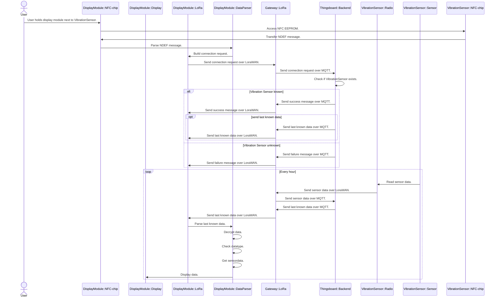

# Sequence
This is the general sequence of the NFC touch & go project. The vibration sensor data retrieval will happen asynchronously.    

```mermaid
sequenceDiagram
    actor user as User
    participant nfcdm as DisplayModule::NFC-chip
    participant displaydm as DisplayModule::Display
    participant loradm as DisplayModule::LoRa
    participant decrypterdm as DisplayModule::DataParser
    participant loragateway as Gateway::LoRa
    participant backendthingsboard as Thingsboard::Backend
    participant lorasensor as VibrationSensor::Radio
    participant sensor as VibrationSensor::Sensor
    participant nfcsensor as VibrationSensor::NFC-chip

    user->>nfcdm: User holds display module next to VibrationSensor.
    nfcdm->>nfcsensor: Access NFC EEPROM.
    nfcsensor->>nfcdm: Transfer NDEF message.
    nfcdm->>decrypterdm: Parse NDEF message.
    decrypterdm->>loradm:Build connection request.
    loradm->>loragateway: Send connection request over LoraWAN.
    loragateway->>backendthingsboard: Send connection request over MQTT.
    backendthingsboard->>backendthingsboard: Check if VibrationSensor exists.
    alt Vibration Sensor known
        backendthingsboard->>loragateway: Send success message over MQTT.
        loragateway->>loradm: Send success message over LoraWAN.
        opt send last known data
            backendthingsboard->>loragateway: Send last known data over MQTT.
            loragateway->>loradm: Send last known data over LoraWAN.
        end
    else Vibration Sensor unknown
        backendthingsboard->>loragateway: Send failure message over MQTT.
        loragateway->>loradm: Send failure message over LoraWAN.
    end

    loop Every hour
        sensor->>lorasensor: Read sensor data.
        lorasensor->>loragateway: Send sensor data over LoraWAN.
        loragateway->> backendthingsboard: Send sensor data over MQTT.

        backendthingsboard->>loragateway: Send last known data over MQTT.
        loragateway->>loradm: Send last known data over LoraWAN.
        loradm->>decrypterdm: Parse last known data.
        decrypterdm->>decrypterdm: Decrypt data.
        decrypterdm->>decrypterdm: Check datatype.
        decrypterdm->>decrypterdm: Get sensordata.
        decrypterdm->>displaydm: Display data.
    end
```
